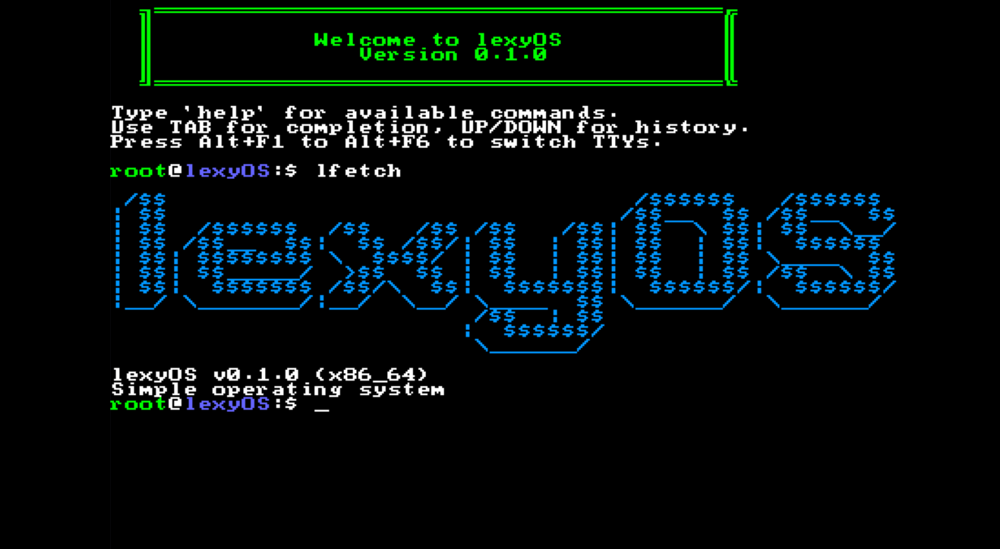
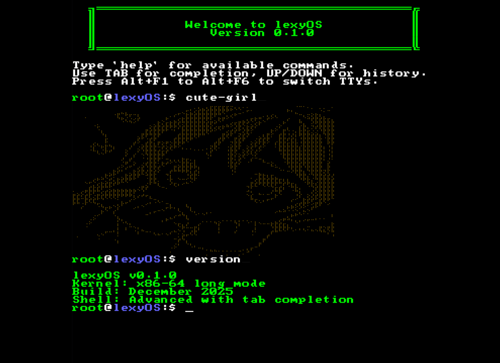

# lexyOS

**lexyOS** is a lightweight, 64-bit hobbyist operating system kernel designed for the x86_64 architecture, built from scratch in C and Assembly. Designed as a fun learning project, it demonstrates advanced OS concepts including interrupt handling, memory management, filesystem support, device drivers, and interactive user interfaces with a built-in shell and terminal games.

> **Note**: lexyOS is a hobby operating system created **just for fun**. It's not intended for production use, but it's a great way to understand how operating systems work at a fundamental level!

## Preview

<div align="center">
  
  
</div>

## ✨ Features

### Core System
- **x86_64 Long Mode**: Full 64-bit architecture support with proper GDT, IDT, and paging
- **Interrupt Handling**: Complete IDT setup with ISR/IRQ handlers and PIC configuration
- **Timer Support**: Programmable Interval Timer (PIT) for system timing

### Memory Management
- **Physical Memory Manager (PMM)**: Efficient physical memory allocation
- **Virtual Memory Manager (VMM)**: Page table management and virtual addressing
- **Heap Allocator**: Dynamic memory allocation for kernel operations

### Filesystem
- **Virtual File System (VFS)**: Abstraction layer for filesystem operations
- **TARFS Support**: Read files from TAR archives bundled with the kernel

### Device Drivers
- **VGA Text Mode**: Classic 80x25 text console
- **Framebuffer Graphics**: Pixel-based graphics output
- **Keyboard Driver**: PS/2 keyboard input with scancode translation
- **Serial Port**: UART serial communication for debugging

### User Interface
- **Multi-Output Console**: Supports both VGA text and framebuffer modes
- **TTY Layer**: Terminal abstraction for I/O operations
- **Interactive Shell**: Command-line interface with:
  - Command history navigation
  - Built-in commands for system interaction
  - File system browsing
- **Terminal Games**: 
  - 🐍 Snake
  - 🟦 Tetris

### Utilities
- **String Library**: Custom implementations of standard string functions
- **8x8 Bitmap Font**: Rendering text on framebuffer

## 🏗️ Project Structure

```
lexyOS/
├── arch/x86_64/          # Architecture-specific code
│   ├── boot.asm          # Bootloader and long mode initialization
│   ├── idt.c             # Interrupt Descriptor Table setup
│   ├── irq.c             # IRQ handling
│   ├── isr.asm           # Interrupt Service Routines
│   ├── pic.c             # Programmable Interrupt Controller
│   └── pit.c             # Programmable Interval Timer
├── drivers/              # Hardware device drivers
│   ├── input/            # Input devices
│   │   └── keyboard.c
│   ├── serial/           # Serial communication
│   │   └── serial.c
│   └── video/            # Display drivers
│       ├── framebuffer.c
│       └── vga_text.c
├── fs/                   # Filesystem implementations
│   ├── tarfs.c           # TAR filesystem
│   └── vfs.c             # Virtual File System
├── kernel/               # Core kernel
│   └── kernel.c
├── mm/                   # Memory management
│   ├── heap.c            # Heap allocator
│   ├── pmm.c             # Physical memory manager
│   └── vmm.c             # Virtual memory manager
├── ui/                   # User interface components
│   ├── console.c         # Console abstraction
│   ├── fb_console.c      # Framebuffer console
│   ├── vga_console.c     # VGA text console
│   ├── tty/              # TTY layer
│   │    └── tty.c
│   ├── shell/            # Interactive shell
│   │   ├── shell.c
│   │   ├── shell_commands.c
│   │   └── shell_history.c
│   ├── terminal_games/   # Built-in games
│   │   ├── game_snake/
│   │        └── game_snake.c
│   │   └── game_tetris/
│   │        └── game_tetris.c
│   └── font/             # Font rendering
│       └── font8x8.c
├── lib/                  # Kernel libraries
│   └── string/
│       └── string.c
├── include/              # Header files
├── grub.cfg              # GRUB bootloader configuration
├── linker.ld             # Linker script
└── Makefile              # Build automation
```

## 🔧 Prerequisites

To build and run lexyOS, you'll need:

- **NASM**: Assembler for boot.asm and ISR routines
- **x86_64-elf-gcc**: Cross-compiler for x86_64 target
- **x86_64-elf-ld**: Cross-linker
- **GRUB 2**: Bootloader
- **QEMU**: For testing and emulation
- **Make**: Build automation
- **xorriso**: ISO image creation

### Install on Arch Linux

```bash
sudo pacman -S nasm binutils grub make wget xorriso qemu-system-x86
```

### Building the Cross-Compiler Toolchain

If you don't have `x86_64-elf-gcc` and `x86_64-elf-ld`, build them from source:

#### 1. Install Build Dependencies

```bash
sudo pacman -S base-devel gmp mpc mpfr texinfo bison flex gawk
```

#### 2. Build the Toolchain

```bash
# Create toolchain directory
mkdir ~/opt/cross
cd ~/opt/cross

# Set environment variables
export PREFIX="$HOME/opt/cross"
export TARGET=x86_64-elf
export PATH="$PREFIX/bin:$PATH"

# Build binutils
wget https://ftp.gnu.org/gnu/binutils/binutils-2.45.1.tar.xz
tar -xf binutils-2.45.1.tar.xz
mkdir build-binutils
cd build-binutils
../binutils-2.45.1/configure --target=$TARGET --prefix="$PREFIX" --with-sysroot --disable-nls --disable-werror
make
make install

# Build GCC
cd ..
wget https://ftp.gnu.org/gnu/gcc/gcc-15.2.0/gcc-15.2.0.tar.xz
tar -xf gcc-15.2.0.tar.xz
mkdir build-gcc
cd build-gcc
../gcc-15.2.0/configure --target=$TARGET --prefix="$PREFIX" --disable-nls --enable-languages=c,c++ --without-headers
make all-gcc
make all-target-libgcc
make all-target-libstdc++-v3
make install-gcc
make install-target-libgcc
make install-target-libstdc++-v3
```

## 🚀 Building lexyOS

Clone the repository and build:

```bash
git clone <your-repository-url>
cd lexyOS
make
```

## 🎮 Running lexyOS

### Using QEMU

```bash
make run
```

This creates a bootable ISO image: `lexyos.iso`.
This boots lexyOS in QEMU with VGA graphics support.

### Using Other Emulators

You can also boot `lexyos.iso` in VirtualBox, VMware, or on real hardware (at your own risk!).

## 🎯 Features to Try

Once lexyOS boots, you can:

- **Use the shell**: Type commands at the prompt
- **Play Snake**: Test your reflexes with the classic game
- **Play Tetris**: Arrange falling blocks
- **Browse files**: If TAR filesystem is mounted
- **Explore**: Discover built-in commands and features

## 🧹 Cleaning Up

Remove all build artifacts:

```bash
make clean
```

## 🎓 What You'll Learn

This project demonstrates:

- x86_64 architecture and long mode initialization
- Hardware interrupt handling (keyboard, timer)
- Memory management (physical, virtual, heap)
- Device driver development
- Filesystem abstraction
- Building interactive user interfaces
- Real-time terminal graphics programming
- Low-level graphics rendering

## 📚 Technical Details

### Boot Process

1. GRUB loads the kernel using Multiboot2
2. `boot.asm` sets up GDT and page tables
3. Transitions to x86_64 long mode
4. Calls `kernel_main()` in C

### Interrupt Handling

- IDT configured with 256 entries
- ISRs handle CPU exceptions (0-31)
- IRQs handle hardware interrupts (32+)
- PIC remapped to avoid conflicts with CPU exceptions
- PIT configured for timer interrupts

### Memory Layout

- Identity mapping for low memory
- Kernel mapped in higher half
- Heap grows dynamically
- Page-aligned allocations

## 🤝 Contributing

This is a fun educational project! Feel free to:

- Report bugs
- Suggest features
- Submit improvements
- Fork and experiment

## 📝 License

This project is open source and available for educational purposes.

## 🙏 Acknowledgments

- [OSDev Wiki](https://wiki.osdev.org/) - Invaluable resource for OS development
- [GNU Project](https://www.gnu.org/) - Toolchain and utilities
- [GRUB](https://www.gnu.org/software/grub/) - Bootloader
- [QEMU](https://www.qemu.org/) - Testing and emulation
- The OS development community for inspiration and support


